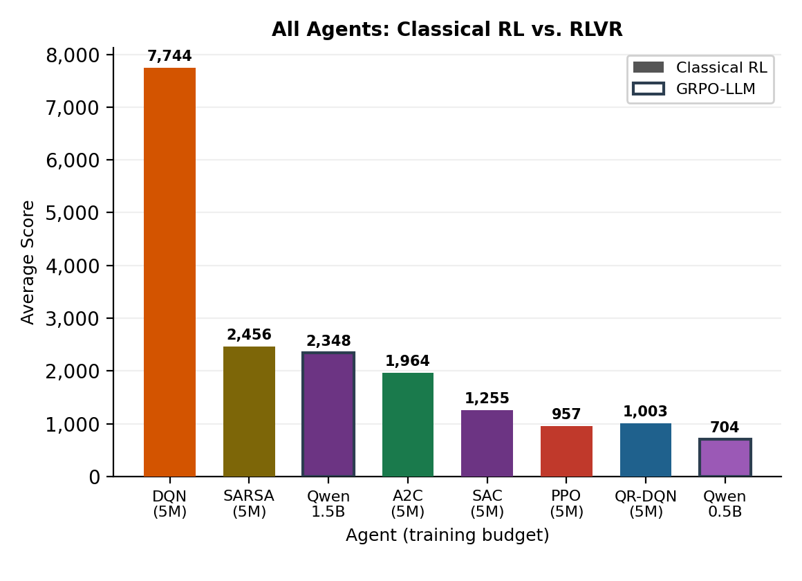
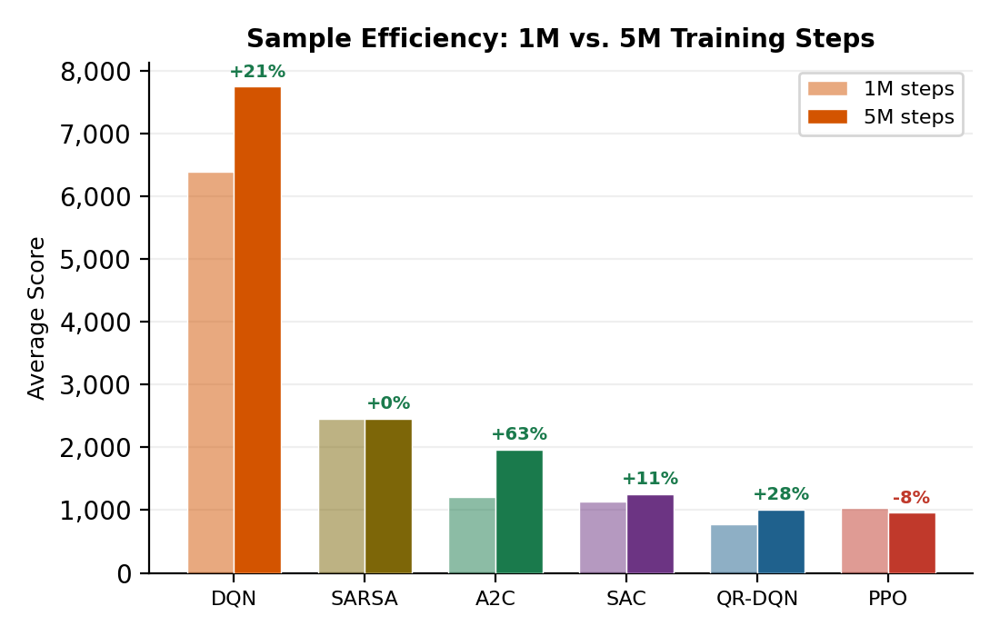
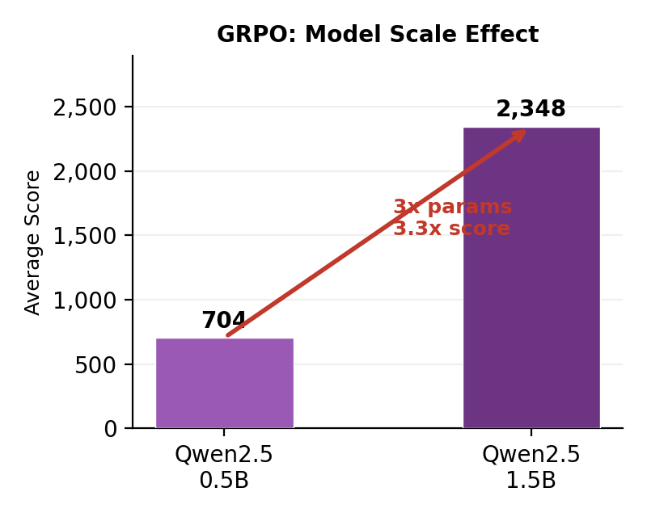
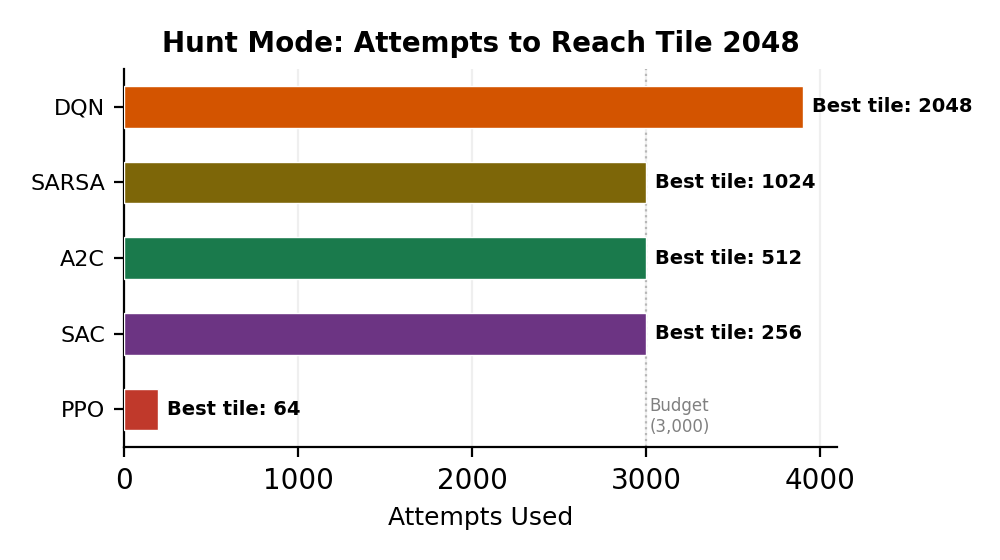
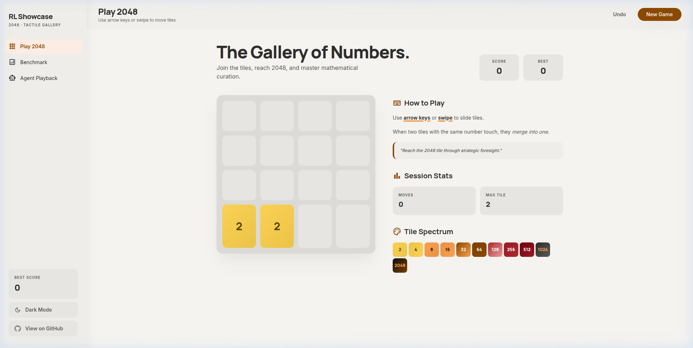
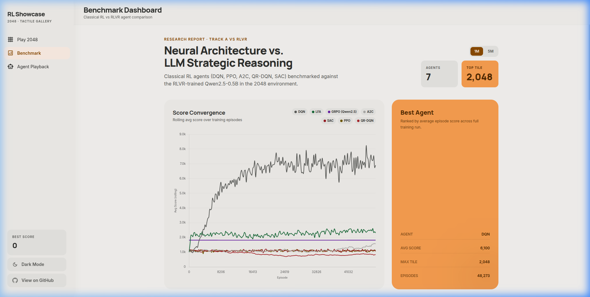
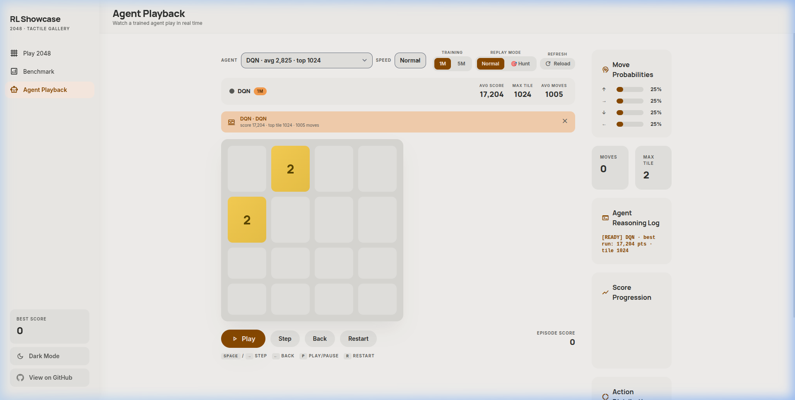

# Solving 2048: Classical RL vs. LLM-Guided RLVR

> **CS 5180 - Reinforcement Learning** &nbsp;|&nbsp; Northeastern University  
> **Authors:** Shriman Raghav Srinivasan, Gautham Ramkumar  
> **Report:** [AAAI-26 Format Paper](report/main.pdf) &nbsp;|&nbsp; [Poster](report/poster_a1.pdf)

A systematic comparative study of **six classical Reinforcement Learning agents** and **two LLM-based RLVR agents** (GRPO-trained Qwen2.5-0.5B and 1.5B) on the puzzle game **2048**. All classical deep agents share an identical 3-layer CNN backbone (330K parameters) to isolate algorithmic effects from architectural differences.

---

## Key Findings

| # | Finding | Evidence |
| --- | ------- | -------- |
| 1 | **Off-policy replay is decisive** | DQN (7,744 avg) outperforms on-policy PPO (957 avg) by 8× on identical architectures |
| 2 | **Hand-crafted features beat deep on-policy networks** | Semi-gradient SARSA with 120 parameters outperforms all deep on-policy agents (330K+ params) |
| 3 | **More training can hurt on-policy agents** | PPO loses 8% score from 1M→5M steps, developing degenerate move loops |
| 4 | **LLM scale drives RLVR performance** | 3× parameters (0.5B→1.5B) yields 3.3× score improvement (704→2,348) |
| 5 | **DQN is the only agent to reach tile 2048** | In hunt mode (unlimited stochastic attempts), DQN reaches 2048 on attempt 3,902 |



---

## Results

### Classical Agents - 5M Training Steps (single seed)

| Agent | Impl. | Avg Score | Max Score | Max Tile | 512+ Rate | 1M→5M Δ |
| ------- | ----- | --------- | --------- | -------- | --------- | -------- |
| **DQN** | Custom PyTorch | **7,744** | **39,314** | **2048** | **76%** | +21% |
| SARSA | Custom NumPy | 2,456 | 11,436 | 1024 | 6% | <1% |
| A2C | SB3 | 1,964 | 9,640 | 1024 | 6% | +63% |
| SAC | Custom PyTorch | 1,255 | 7,882 | 512 | <1% | +11% |
| QR-DQN | SB3-Contrib | 1,003 | 4,508 | 512 | 0% | +28% |
| PPO | SB3 (Maskable) | 957 | 4,900 | 512 | 0% | −8% |



### GRPO-Trained LLMs - 500 Training Steps over 2,000 Prompts

| Model | Avg Score | Max Tile | Params | ms/move | Training Time |
| ------- | --------- | -------- | ------ | ------- | ------------- |
| **Qwen2.5-1.5B** | **2,348** | **256** | 1.8B | ~1,500 | ~76 min |
| Qwen2.5-0.5B | 704 | 64 | 494M | ~1,500 | ~41 min |



### Hunt Mode - 1M Checkpoint, ε=0.05, Unlimited Attempts

| Agent | Attempts | Best Tile | Best Score |
| ------- | -------- | --------- | ---------- |
| **DQN** | 3,902 | **2048** | **21,572** |
| SARSA | 3,000 | 1024 | 12,300 |
| A2C | 3,000 | 512 | 7,844 |
| SAC | 3,000 | 256 | 3,648 |
| PPO | 193 | 64 | 520 |



---

## Project Structure

```text
RLVR/
├── src/
│   ├── env/                     # 2048 Game Engine & Wrappers
│   │   ├── game_2048.py         # Core engine (pure NumPy, 4×4 board)
│   │   ├── gym_wrapper.py       # Gymnasium env (16-channel binary tensor, action masking)
│   │   └── text_wrapper.py      # ASCII text wrapper for LLM prompt formatting
│   │
│   ├── classical/               # Classical RL Agents
│   │   ├── dqn_agent.py         # Custom DQN (CNN, 100K replay buffer, target net, n_envs=1)
│   │   ├── ppo_agent.py         # MaskablePPO via SB3 (rollout=512, n_envs=8)
│   │   ├── a2c_agent.py         # A2C via SB3 (5-step returns, n_envs=8)
│   │   ├── qrdqn_agent.py       # QR-DQN via SB3-Contrib (50 quantiles, n_envs=8)
│   │   ├── sac_agent.py         # Discrete SAC (custom, twin Q-nets, 200K buffer, n_envs=8)
│   │   ├── lfa_agent.py         # Semi-gradient SARSA (30-dim features, 120 parameters)
│   │   ├── hunt_2048.py         # Hunt mode: unlimited attempts until tile 2048
│   │   ├── replay_gen.py        # Best-episode replay JSON generator
│   │   ├── export_all.py        # Batch export replays + manifest
│   │   ├── scaling_eval.py      # Evaluate milestone checkpoints → scaling curves
│   │   └── train.py             # Unified CLI: train / eval / replay
│   │
│   ├── llm/                     # LLM-RLVR Agents
│   │   ├── train_grpo.py        # GRPO training (Unsloth + TRL + Qwen2.5)
│   │   ├── reward.py            # Multi-component verifiable reward functions
│   │   ├── dataset.py           # Board-state dataset generator (2,000 prompts)
│   │   ├── predict.py           # Inference / evaluation for trained LLM
│   │   ├── prompt.py            # System prompt template (<think>/<answer>)
│   │   └── replay_gen.py        # LLM replay generator
│   │
│   ├── utils/
│   │   └── metrics.py           # CSV logger + matplotlib training curves
│   └── visualize.py             # Standalone visualization utilities
│
├── configs/                     # YAML hyperparameter configs
├── tests/                       # pytest suite (env + reward tests)
├── report/                      # AAAI-26 format LaTeX report + poster
│   ├── main.tex / main.pdf      # 10-page comparative study
│   ├── poster_a1.tex            # A1 research poster
│   ├── aaai26.sty               # AAAI style file
│   └── fig_*.png                # All figures (training curves, comparisons)
│
├── logs/                        # Training outputs (per-agent subdirectories)
│   ├── dqn_5m/ ppo_5m/ ...      # Classical agent logs, checkpoints, replays
│   ├── grpo_0.5b/ grpo_1.5b/    # GRPO adapter weights, merged models, train logs
│   └── manifest.json            # Agent registry for dashboard
│
├── index.html                   # Interactive web dashboard
├── serve.py                     # Dev HTTP server
└── requirements/                # Dependency files (base, classical, llm)
```

---

## Environment Design

The 2048 game is modeled as a finite-horizon MDP:

- **State space:** 16-channel binary tensor `x ∈ {0,1}^{16×4×4}` (CNN agents) or labeled ASCII grid (LLM agents)
- **Action space:** {UP, RIGHT, DOWN, LEFT} - 4 discrete actions
- **Transition:** Deterministic tile-sliding + stochastic spawn (90% tile-2, 10% tile-4)
- **Reward:** Score-delta + milestone bonuses (+50 at 256, +100 at 512, +200 at 1024) + penalty for invalid moves (−1)
- **Discount:** γ = 0.99

All deep classical agents share an identical 3-layer CNN backbone:

```text
Conv2D(16→128, 2×2) → ReLU → Conv2D(128→128, 2×2) → ReLU → Conv2D(128→128, 2×2) → ReLU → FC(128→256)
```

---

## Agent Details

### Custom Implementations (PyTorch / NumPy)

**DQN** - Custom PyTorch implementation with invalid Q-value masking inside the forward pass (SB3's DQN lacks this). Replay buffer 100K, batch 64, ε: 1.0→0.01 over 100K steps, target sync every 1K steps, lr=1e-4, gradient clipping 1.0.

**SAC (Discrete)** - Custom adaptation of Christodoulou (2019) with categorical policies, twin Q-networks, and automatic temperature tuning. Buffer 200K, batch 256, Polyak τ=0.005, target entropy 0.4·log|A|.

**Semi-gradient SARSA** - Sutton & Barto Algorithm 10.1 with 30-dimensional hand-crafted features:

| Features (30 total) | Dim | Description |
| --------------------- | --- | ----------- |
| Log-tile values | 16 | `log₂(B[i,j]+1)/16` for each cell |
| Empty ratio | 1 | Fraction of empty cells |
| Merge potential | 1 | Count of adjacent equal pairs, normalized |
| Monotonicity | 4 | One score per row/column direction |
| Max-tile indicator | 1 | `log₂(max B)/16` |
| Corner bonus | 1 | `1` if max tile is in a corner |
| Tile distribution | 3 | Mean/std/max of log-tile values |
| Smoothness | 1 | Negative sum of adjacent tile differences |
| Snake pattern | 1 | Score measuring zigzag tile arrangement |
| Edge-tile sum | 1 | Sum of log-tiles on board edges |

Weight matrix: `w ∈ ℝ^{4×30}` = 120 parameters. Step-size α=1e-3, ε-decay 0.99995/step, ε_min=0.05.

### Stable-Baselines3 Agents

**PPO** (MaskablePPO) - Rollout 512 steps × 8 envs, batch 128, 4 epochs, lr=2e-4, γ=0.995, clip ε=0.2, entropy coef=0.05.

**A2C** - 5-step returns, lr=7e-4, entropy coef=0.01, value coef=0.5.

**QR-DQN** - 50 quantiles (4×50=200 output values), buffer 100K, batch 64, lr=1e-4, target sync 1K steps.

### GRPO-Trained LLMs

**Training Pipeline:** Qwen2.5-Instruct models fine-tuned via GRPO (Group Relative Policy Optimization) using 4-bit NF4 quantization via Unsloth + LoRA (r=16, α=16).

| Parameter | 0.5B Model | 1.5B Model |
| --------- | ---------- | ---------- |
| Base model | Qwen2.5-0.5B-Instruct | Qwen2.5-1.5B-Instruct |
| Parameters | 494M | 1.8B |
| Dataset | 2,000 board-state prompts | 2,000 board-state prompts |
| Generations per prompt (G) | 4 | 4 |
| Training steps | 500 | 500 |
| Epochs | 3 | 3 |
| Learning rate | 1e-6 | 5e-7 |
| LoRA r / α | 16 / 16 | 16 / 16 |
| Training time | ~41 min | ~76 min |
| Seed | 42 | 42 |

**Why Local GRPO, Not an LLM API?** GRPO requires per-token log-probabilities and their gradients for the clipped policy update - commercial APIs don't expose model weights or gradient computation. Local deployment also ensures deterministic training under fixed seeds.

**Reward Schedule (3-stage curriculum):**

1. Steps 0–100: Format compliance only (XML tag structure, weight 0.5)
2. Steps 100–200: + Direction validity (weight 0.5)
3. Steps 200–500: + Game reward (Δscore/max_tile, weight 2.0)

Length and quality bonuses were removed after reward-hacking was detected (model generated filler text to maximize length rewards).

---

## Quick Start

### 1. Environment Setup

```bash
python -m venv venv && source venv/bin/activate
pip install -r requirements/base.txt
```

### 2. Play 2048 Interactively

```bash
python -m src.env.game_2048
# Controls: W=Up, A=Left, S=Down, D=Right, Q=Quit
```

### 3. Train Classical Agents

```bash
pip install -r requirements/classical.txt

# DQN (custom, ~2 hrs for 5M steps)
python -m src.classical.train train --agent dqn --steps 5000000 --mode 5m

# PPO (SB3, MaskablePPO)
python -m src.classical.train train --agent ppo --steps 5000000 --mode 5m

# Semi-gradient SARSA (NumPy, very fast)
python -m src.classical.train train --agent lfa --steps 5000000 --mode 5m
```

### 4. Train GRPO LLM Agent (requires GPU)

```bash
pip install -r requirements/llm.txt

# GRPO training - Qwen2.5-0.5B + QLoRA 4-bit
python -m src.llm.train_grpo \
  --dataset-size 2000 \
  --epochs 3 \
  --num-generations 4 \
  --lr 1e-6
```

### 5. Hunt Mode

```bash
# Run agents until tile 2048 or 3,000 attempts exhausted
python -m src.classical.hunt_2048
python -m src.classical.hunt_2048 --agents dqn lfa  # subset
```

### 6. Launch Web Dashboard

```bash
python serve.py          # http://localhost:8080
```

| Dashboard View | Description | Screenshot |
| ---------------- | ----------- | ---------- |
| **Play 2048** | Interactive game with undo, score tracking |  |
| **Benchmark** | Score convergence charts, comparative metrics |  |
| **Agent Playback** | Step-by-step replay with move-probability bars |  |

### 7. Run Tests

```bash
python -m pytest tests/ -v
```

---

## Hardware

| Resource | Specification |
| ---------- | --------------- |
| **GPU** | NVIDIA RTX 4060 Laptop (8 GB VRAM) |
| **GRPO VRAM** | ~4–6 GB (0.5B/1.5B model, QLoRA 4-bit, G=4) |
| **Python** | 3.10+ |
| **OS** | Ubuntu 22.04, CUDA 12.6 |

---

## Report & Poster

The research report follows the **AAAI-26 conference format** and covers:

1. **Abstract** - Problem statement and key results
2. **Introduction** - Why 2048 is a challenging benchmark; classical RL vs RLVR motivation
3. **Background** - MDP formulation, value-based methods, policy-gradient methods, linear FA, GRPO
4. **Related Work** - n-tuple TD networks (SOTA at tile 65536), deep RL for games, LLMs for game-playing, RLVR
5. **Project Description** - Environment, shared CNN backbone, all agent implementations with hyperparameters, GRPO pipeline
6. **Experiments** - 1M/5M/Hunt mode evaluation tiers, mechanism analysis of DQN dominance, on-policy degradation, GRPO scaling and spatial failure analysis
7. **Conclusion** - Four key findings with appropriate hedging for single-seed limitations

---

## References

1. Guo et al. (2025). _DeepSeek-R1: Incentivizing Reasoning Capability in LLMs via Reinforcement Learning._ Nature.
2. Shao et al. (2024). _DeepSeekMath: Pushing the Limits of Mathematical Reasoning in Open Language Models._
3. Sutton & Barto (2018). _Reinforcement Learning: An Introduction._ 2nd ed. MIT Press.
4. Mnih et al. (2015). _Human-Level Control Through Deep Reinforcement Learning._ Nature.
5. Schulman et al. (2017). _Proximal Policy Optimization Algorithms._
6. Haarnoja et al. (2018). _Soft Actor-Critic: Off-Policy Maximum Entropy Deep Reinforcement Learning._
7. Dabney et al. (2018). _Distributional Reinforcement Learning with Quantile Regression._
8. Szubert & Jaśkowski (2014). _Temporal Difference Learning of N-Tuple Networks for the Game 2048._
9. Hu et al. (2025). _lmgame-Bench: How Good are LLMs at Playing Games?_
10. Raffin et al. (2021). _Stable-Baselines3: Reliable Reinforcement Learning Implementations._

---

## License

This project was developed as part of CS 5180 (Reinforcement Learning) taught by Professor Robert Platt at Northeastern University.
